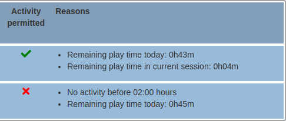
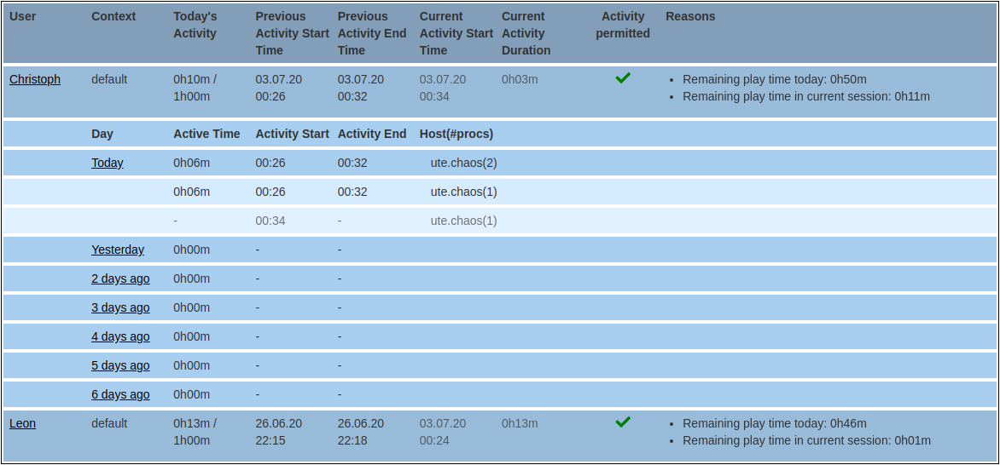
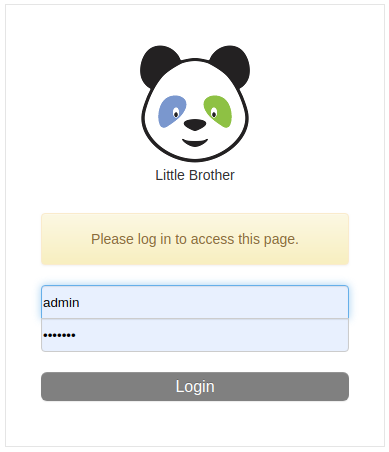
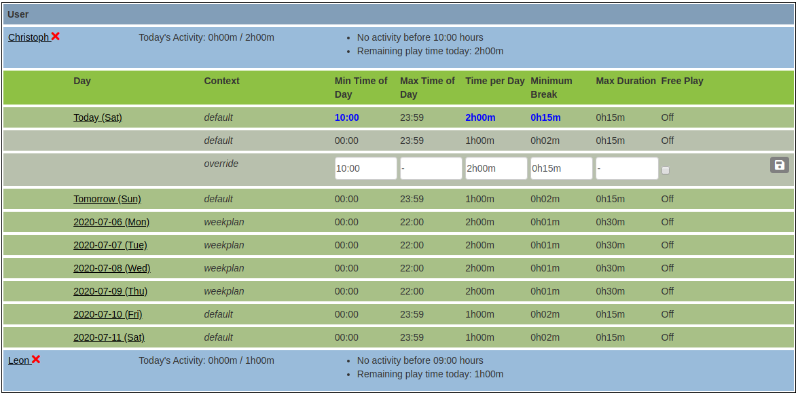
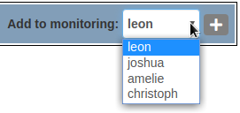

# Web-Frontend Manual

This page describes the web frontend of `LittleBrother` which usually can be reached at 
[http://localhost:5555](http://localhost:5555) on your local machine. It offers access to status information (without
login) and a configuration interface (with login). 

## Listing the Status

The menu entry "Status" lists the monitored users. The top level shows the summary of the play times.

A blinking entry denotes an active login. In case the user is currently allowed to play (see green check mark) the 
column "reasons" shows the estimated remaining play times for the current session (if logged in) and for the day.
If the user is currently blocked (see red cross) the same column shows the reasons why the user is not permitted to 
play and the estimated remaining play time for the day.

The columns contain the following details:

*   *Context*: Shows the active ruleset context for the day.

*   *Today's Activity*: Shows the overall active time and the maximum activity duration for the current day. If one of 
the hosts had a downtime, this column will also show the detected downtime (in yellow) which will be subtracted from 
the play time.
  
*   *Previous Activity Start Time*: the time of day when the most recent (except for the current) activity started.

*   *Previous Activity End Time*: the time of day when the most recent (except for the current) activity ended.

*   *Current Activity Start Time*: the time of day when the current activity started. If the user is not currently
logged in this column will be empty. If there is a current activity, this value will be blinking.

*   *Current Activity Duration*: the time duration of the current activity. If the user is not currently 
logged in this column will be empty. If there is a current activity, this value will be blinking.
   
     
The second level can be opened by clicking on the name of a user. It will show the daily play time, the number 
of logins and the hosts of the last seven days of the selected user.

The columns contain the following details:

*   *Active Time*: The overall play time on that day.
*   *Activity Start*: The earliest login of the user on that day. 
*   *Activity Start*: The latest logout of the user on that day.
*   *Host(#procs)*: A list of hosts that the user logged into on that day including the number of logins on each host. 

The third level can be opened by clicking on a day summary of a user. It will show the individual play times and
hosts of the selected user on the selected day. The entries are sorted by the start time in descending order with
the most recent entry at the top.   

## About Page

The page shows some status information of the installed version of `LittleBrother` and a list of supported languages.
When reporting issues on GitHub it is usually very helpful for the developers if you include the *Git Commit ID*
into your issue text.
 
  

## Logging In

The status page and the about page are accessible without login. All other pages require the login credentials of
an administration user. Currently, the name of the administration user defaults to `admin`. The password needs to
be set in the configuration file (see the main [README](README.md)).

  

After successful login the user will be display in the menu bar.

  

## Administration

The administration page enables the administrator to override the default restrictions for the monitored users. 
This is possible for the current day and up to 7 days into the future.

The top level shows the names and today's activity of the current monitored users.
In case the user is currently allowed to play (see green check mark) the 
row shows the estimated remaining play times for the current session (if logged in) and for the day.
If the user is currently blocked (see red cross) the row shows the reasons why the user is not permitted to 
play and the estimated remaining play time for the day.

   
The second level can be opened by clicking on the name of a user. It will show the active restrictions of
the current day and the next seven days of the selected user. The column "Context" denotes which ruleset is active
on the respective day. The entries are sorted by the start time in ascending order with
the current day at the top.

The third level can be opened by clicking on a day row. It will show input fields to override the default
restrictions of the active ruleset of the selected day.    

To override settings enter the desired values and click the save button.

Most of the input fields require a certain input format. If the values violate the format, 
a validation message will be displayed. All errors have to be taken care of before the settings will be saved.

When default values are overridden the day row shows the values in blue color. Removing the overriding values 
removes the color again. 

## Configuring Users

Before a user can be monitored she has to be added to the users list of `LittleBrother`. After installation the
users list is empty. The application will try to retrieve the users on the master host by querying the 
`/etc/passwd` file using standard Python libraries. See [Users and UIDs in README](README.md) for details. 

All users found that are not being monitored yet will be offered in the drop down menu following "Add to monitoring":

To add the user choose the user name from the drop down list and click the add button:

After the user has been added her top level entry will be shown:

Click on the username to change to second level of the user entry:

The details will show the following items:

*   *Monitored*: denotes if the user will actually be monitored. This will be un-ticked for all new users and should 
only be ticked off after the user has been configured completely using rulesets and optionally devices.

*   *First Name*: sets the first name of the user. When set the first name will be used in notifications instead of the
username which may be unpronounceable. 

*   *Last Name*: sets the last name of the user. This is only used as label in lists.

*   *Locale*: sets the language in which notifications are spoken to the user. The locale will be passed on to the
tool [LittleBrotherTaskbar](https://github.com/marcus67/little_brother_taskbar) to this purpose. For a new user
the locale always defaults to the locale which is detected from the browser.

*   *Process Name Pattern*: sets a regular expression defining the processes which represents a "login" by the user. 
The default value comprises all standard shells and `systemd` which is started by login process using X11. Only change
this setting if you absolutely know what you are doing.
 
### Adding Rulesets

When a new user is created, there is always one default rule created for her which will act as a fallback if no other
rule applies. However, the new rule does not contain any restrictions yet:

Use the entry fields to optionally change the default settings:

The fields represent the following restrictions/meaning:

*   *Label*: changes the default label of the rule in lists and messages.

*   *Context*: sets the context (type) of rule. Currently, there are three contexts available. See below.

*   *Context details*: sets the specific details of the chosen context. See below.

*   *Min Time of Day*: optionally sets the earliest time of the day when login is allowed. Timestamps must be given 
in the format `HH:MM` in military time. Time durations must be given in the format `HHh:MMm`.  Either part may be 
omitted and the minutes may exceed 60.
   
*   *Max Time of Day*: optionally sets the latest time of the day when login is allowed. The format is the same 
as above.  

*   *Time per Day*: optionally sets the duration that the user is allowed to be logged in (for the whole day). 
The format must be `HHh:MMm` for `HH` hours and `MM` minutes. Either part can be omitted.  

*   *Minimum Break*: optionally sets a mandatory break time between sessions. The format is the same as above.

*   *Max Duration*: optionally sets the maximum length of a session. The format is the same as above.

*   *Free Play*: If ticked, the user is allowed to play without any restrictions. Any other restriction in the same
rule will be suppressed.

### Computing the Break Time

When there is a maximum session time and a minimum break time configured for a rule `LittleBrother` tries to compute
a *fair* break duration as follows:

*   If a user has played her full maximum session time the whole configured break time will apply.

*   If a user has played less than her maximum session time the break time will be enforced proportionally that is
the effective break time compared to the configured break time will have the same ratio as the actual session time
to the maximum session time. Example: the maximum session time is set to 1 hour and the break time to 30 minutes. The
user decides to play for 40 minutes in her session which accounts for two thirds of the maximum session time. Hence
the break time will be `2/3*30=20` minutes.    

### Rule Contexts

Each rule can be seen as a day selector. If all days are to be treated equally one rule should do the job. 

If different days are to be treated differently more rules are required besides the default *catch all* rule. 
To this purpose the setting *Context* can be used. If its value is `weekplan` the setting
*Context Details* will contain either:

*   the concrete name of the day of the week,

*   the string `weekend` comprising Saturday and Sunday, or day-coded seven-character string in which `1`, `X`, or `Y` 
denotes an active day and any other character denotes an inactive day. For example: the string "X-X-X--" would denote 
a rule which is active on Mondays, Wednesdays, and Fridays. 

If the value of *Context* is `german-vacation-calendar` the rule is active for all vacation days of a specific 
federal state in Germany. In this case the value of `context_details` denotes the name of the federal state:

*   `Baden-Württemberg`,
*   `Bayern`,
*   `Berlin`,
*   `Brandenburg`,
*   `Bremen`,
*   `Hamburg`,
*   `Hessen`,
*   `Mecklenburg-Vorpommern`,
*   `Niedersachsen`,
*   `Nordrhein-Westfalen`,
*   `Rheinland-Pfalz`,
*   `Saarland`,
*   `Sachsen`,
*   `Sachsen-Anhalt`,
*   `Schleswig-Holstein`, or
*   `Thüringen`.

Note that the vacation schedules are retrieved from the web site 
[www.mehr-schulferien.de](https://www.mehr-schulferien.de). The author of `LittleBrother` cannot be held responsible 
for incorrect schedules.
 
### Associating Devices with Users

In addition to the hosts which are scanned for logins of the monitored users `LittleBrother` can be configured to
also scan the activity on other devices, e.g. game consoles or smart phones. The assumption is that there is activity 
on one of these
devices when they respond to a [ping](https://searchnetworking.techtarget.com/definition/ping). Of course, this is a
simplification but it may work in some cases. Please, consider the inherent restrictions:

*   The fact that a ping is received just means that the device is "on". However, there may not be any activity on it.
In this case the play time will be overestimated. Also some devices may automatically turn on to check for updates.
This will result in phantom play time (sometimes at very odd hours of a day).

*   The ping cannot differentiate between users. So this setup only works well, if the devices can clearly be
associated with monitored users and are not shared too often.

*   Devices which can be played offline will not respond to a ping if disconnected from the local network. In this 
case the play time will be underestimated.

*   The ping returned by smart phones is sometimes hard to interpret. The correlation between successful pings and
actual usage is small. The monitoring has to be improved by actually measuring the delay of the ping which requires
some fine tuning.

**Note**: The following steps are only available if devices have already been set up. See section 
*Configuring Devices* below. 

To associate a device with a user select the device from the popdown menu

and click the add button

The top level device overview will show a comma seperated list of all devices.

 
Clicking on *Devices* will open the second level with a list of all device association and some details

In order to change the settings of a device association clicking on the device name. This will open the third level:

The columns contain the following details:

*   *Monitored*: denotes if the device is scanned for the user. Use this switch to temporarily deactivate the scanning.
The flag is off by default. It needs to be activated for a new association.

*   *Percent*: denotes the percentage with which the active time of this device will added as play time to the 
associated user. The default is 100%. Choosing a value below 100% can be interpreted as e.g. a "social" bonus for a 
console which allows multi player games or e.g. a typical fraction of time that the user spends on the device 
compared to the overall use of the device (by other users).

To save the settings click on the save button:    

 
## Configuring Devices

        
In addition to the processes of the Linux host the application `LittleBrother` can be configured to monitor 
activity on other devices by using the ICMP protocol (`ping`). The assumption is that when a device returns a 
quick response to ping it is currently active (or rather has an active user logged in). If, on the other hand,
the response is slow or if there is no response at all the device is regarded as inactive.

Note that `LittleBrother` is not able terminate any processes on the monitored devices so that the users
may easily exceed their permitted access times there. However, any login times on these devices are added to
the access times on the Linux hosts so that the remaining access time is still influenced. Also, the minimum
break time will apply the point of time when the last other device became inactive.      

The top level of the devices page shows a list of all configured devices. If the devices are associated with users
their names are shown and also their respective usage percentages.

Clicking on a device name opens the second level showing details on the specific device.

The fields have the following meaning:

*   *Name*: The logical name of the device which will show up in lists. The logical name has to be unique across all
devices.

*   *Host Name*: The DNS name or IP address of the device. This address will be used for *pinging* the device. It has to
be a valid address which can be resolved by the name server. Otherwise the entry will be rejected. Also, the hostname
has to be unique across all devices. If you want to monitor devices in your local WIFI you have to see to it 
that your WIFI router always issues the same IP numbers to the same devices. Usually, there is a way to configure the
router accordingly. Look out for *persistent IP addresses* in the manual.

*   *Min Activity Duration \[s\]*:  Denotes how many seconds a ping has to be responsive before the device is regarded 
as active. Durations shorter than this period will be ignored completely.

*   *Max Active Response Delay \[ms\]*: Denotes the maximum response time (measured in milliseconds) a ping may have to 
still be regarded as 'active'. For game consoles (often using the local area network) a low value of 10 \[ms\] is 
usually OK. For smart phone using WIFI the value needs to be higher since these devices have a more sluggish response. 
For iPhones over WIFI values between 50 \[ms\] and 80 \[ms\] have been tested to work pretty well. You will have to 
monitor the value a little bit during the initial phase. If `LittleBrother` often detects activity where there is none, 
decrease the value. If, on the other had, activity often goes undetected, increase the value.

*   *Sample Size*: Denotes the number of delay samples used to compute the effective delay as moving average. This value
can probably be left as it is.   

To make changes enter the desired values and click the save button.

### Adding devices

To add a new device click the add button in the top row:

A new device is added with the generic name "New Device N". Open the entry, edit the settings, and save them. 

